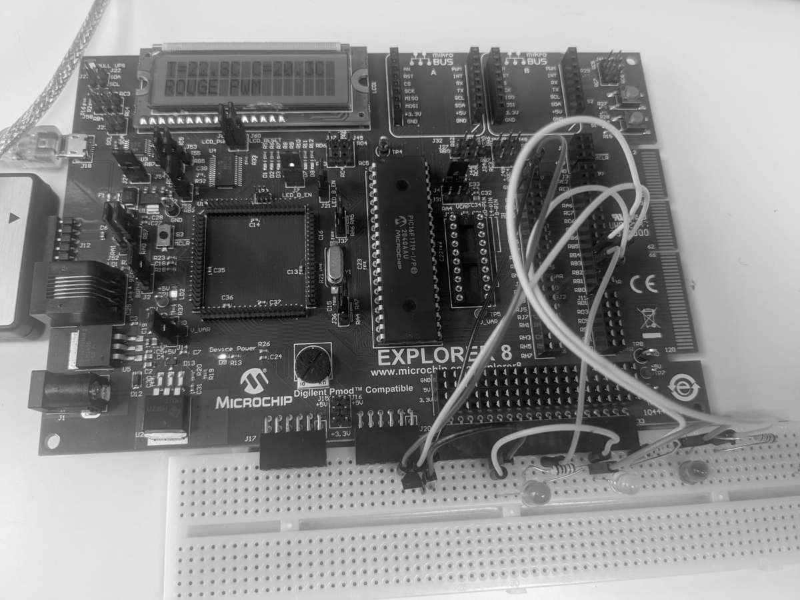
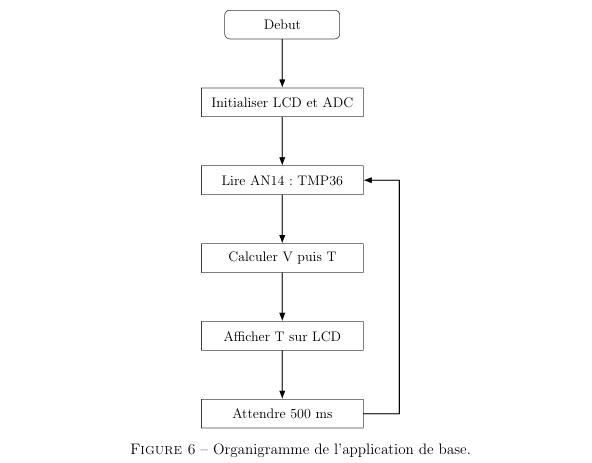
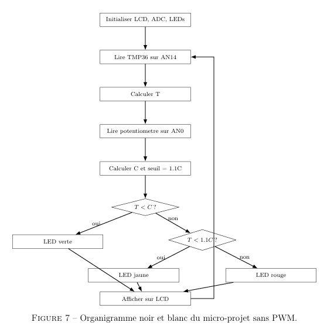
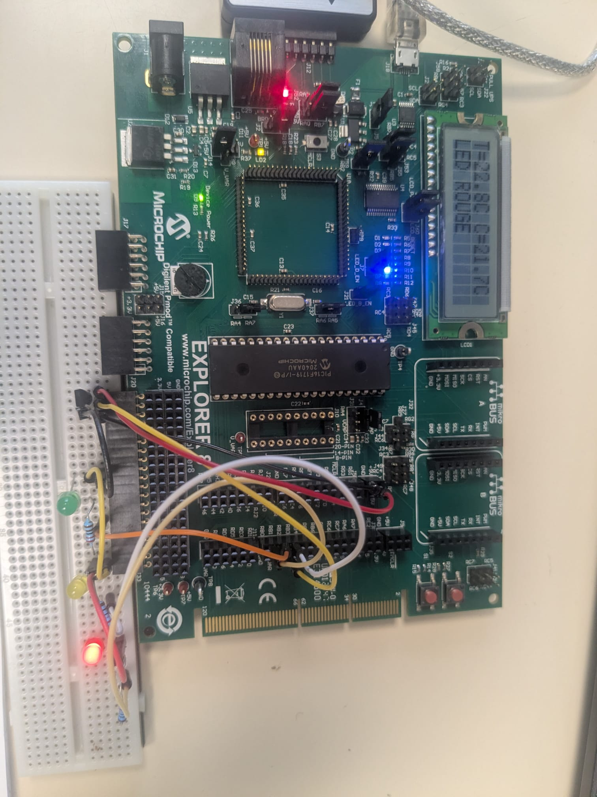
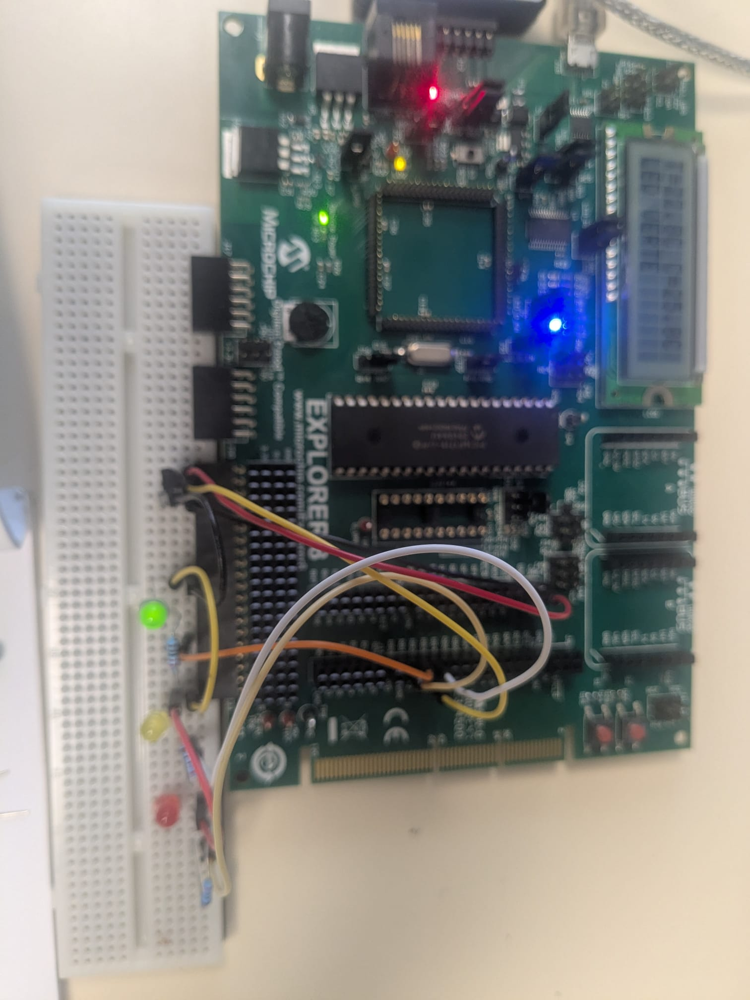
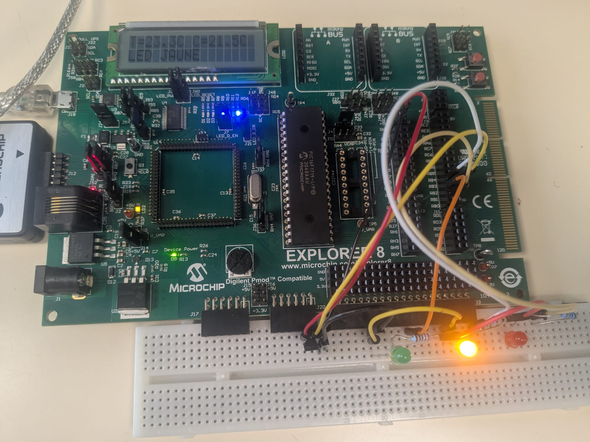
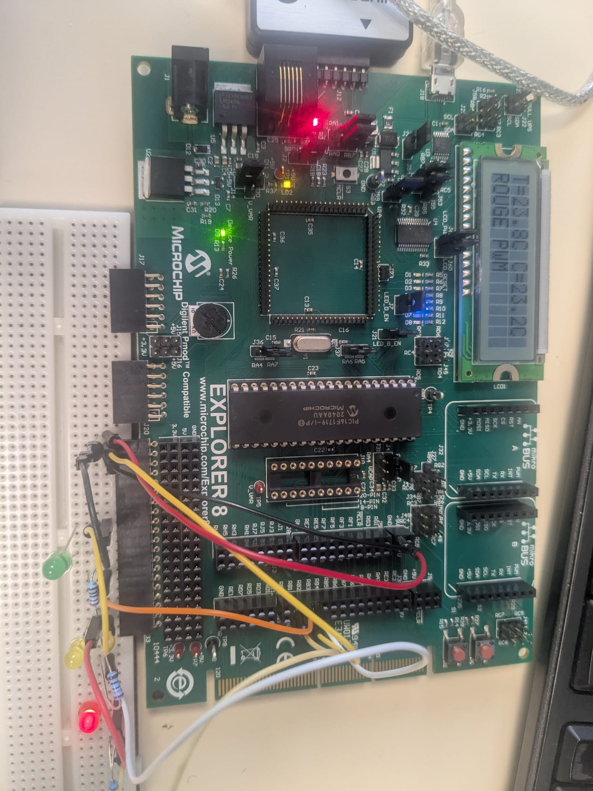

# PIC16F1719 Temperature Control System

<p align="center">
  <strong>Embedded temperature monitoring and threshold-control application on a PIC16F1719</strong><br>
  Explorer 8 · TMP36 · 10-bit ADC · LCD · PWM · GPIO · PPS
</p>

<p align="center">
  
</p>

<p align="center">
  <strong>Academic embedded-systems project — ENSIM · Le Mans University · 2025–2026</strong>
</p>

---

## Overview

This project implements a **temperature monitoring and control application** on a **Microchip PIC16F1719** mounted on an **Explorer 8 Development Board**.

The system:

- measures ambient temperature using a **TMP36 analog temperature sensor**;
- reads a user-defined temperature setpoint from the Explorer 8 onboard potentiometer;
- displays the current temperature, setpoint and system state on an LCD;
- drives three LEDs to indicate the operating state;
- uses **PWM on the red LED** when the temperature exceeds the critical threshold by more than 10%.

The project was developed progressively, starting with a basic temperature-display application and then extending it into a complete threshold-based control system.

---

## Main features

- **PIC16F1719** 8-bit microcontroller
- **TMP36 analog temperature sensor**
- **10-bit ADC acquisition**
- **8-sample averaging** for more stable measurements
- Configurable temperature setpoint from **15 °C to 45 °C**
- LCD display of temperature and setpoint
- Three-state indication using green, yellow and red LEDs
- **PWM alarm control** on the red LED
- **Peripheral Pin Select (PPS)** routing of PWM2 to RB1
- Experimental validation on physical hardware

---

## Hardware

### Main components

| Component | Role |
|---|---|
| Microchip Explorer 8 | Development platform |
| PIC16F1719 | Main microcontroller |
| TMP36 | Analog temperature sensor |
| Explorer 8 potentiometer R25 | User-defined temperature setpoint |
| LCD | Temperature, setpoint and state display |
| Green LED | Temperature below setpoint |
| Yellow LED | Temperature above setpoint but below critical level |
| Red LED | Critical temperature alarm |
| Current-limiting resistors | LED protection |
| Breadboard | External sensor and LED wiring |

The PIC16F1719 provides the peripherals used in this project: a **10-bit ADC**, timers, PWM and **Peripheral Pin Select (PPS)**.

---

## Final pin assignment

The final wiring was selected after experimental testing.

| Function | PIC pin | Peripheral / signal | Purpose |
|---|---|---|---|
| TMP36 temperature sensor | `RC2` | `AN14` | Stable analog temperature input |
| Setpoint potentiometer | `RA0` | `AN0` | User-defined temperature reference |
| Red LED | `RB1` | `PWM2` via PPS | Critical alarm with variable duty cycle |
| Green LED | `RB2` | GPIO | Temperature below setpoint |
| Yellow LED | `RB3` | GPIO | Intermediate warning state |
| LCD | Explorer 8 LCD connector | LCD bus | Temperature and status display |

A key debugging result was the use of **RC2 / AN14** for the TMP36. Earlier configurations caused the measured temperature to vary when the setpoint potentiometer was moved. Separating the sensor input from the potentiometer input produced a stable measurement.

---

# System principle

The control logic compares the measured temperature `T` with the user-defined setpoint `C`.

```text
T < C
    → GREEN LED

C ≤ T < 1.1 × C
    → YELLOW LED

T ≥ 1.1 × C
    → RED LED controlled by PWM
```

This gives the system three operating regions:

| Condition | State | Output |
|---|---|---|
| `T < C` | Normal | Green LED |
| `C ≤ T < 1.1C` | Warning | Yellow LED |
| `T ≥ 1.1C` | Critical | Red LED + PWM |

---

# 1. Basic temperature acquisition

The first stage of the project consisted of validating the TMP36 acquisition and LCD display before adding the complete control logic.

<p align="center">
  
</p>

The sequence is:

```text
Initialize LCD and ADC
        ↓
Read TMP36 on AN14
        ↓
Convert ADC value to voltage
        ↓
Convert voltage to temperature
        ↓
Display temperature on LCD
        ↓
Wait 500 ms
        ↓
Repeat
```

---

## ADC conversion

The PIC16F1719 ADC provides a **10-bit result**, therefore:

```text
ADC ∈ [0, 1023]
```

Using a 5 V reference:

```text
V = ADC × 5 / 1023
```

The TMP36 has an approximately 500 mV offset at 0 °C and a sensitivity of 10 mV/°C.

The conversion used in the application is:

```text
T(°C) = (V - 0.5) × 100
```

---

## ADC averaging

To reduce measurement fluctuations, each analog value is computed from **8 ADC conversions**:

```c
uint16_t Lire_ADC_Moyenne(uint8_t canal)
{
    uint32_t somme = 0;

    ADCON0bits.CHS = canal;

    for (uint8_t i = 0; i < 8; i++)
    {
        __delay_us(50);
        ADCON0bits.GO_nDONE = 1;

        while (ADCON0bits.GO_nDONE);

        somme += ((uint16_t)ADRESH << 8) | ADRESL;
    }

    return (uint16_t)(somme / 8);
}
```

The acquisition delay gives the ADC sampling capacitor time to settle after channel selection.

---

# 2. Setpoint and three-state control

The micro-project extends the basic application by adding:

- setpoint acquisition on `RA0 / AN0`;
- a configurable setpoint range;
- three output states;
- LCD status information.

<p align="center">
  
</p>

The potentiometer ADC value is mapped to a setpoint between **15 °C and 45 °C**:

```text
C = 15 + ADCpot × 30 / 1023
```

The critical threshold is then:

```text
Critical threshold = 1.10 × C
```

---

# 3. PWM critical alarm

The final extension replaces the simple red-LED state with a PWM-controlled alarm.

PWM is enabled **only when**:

```text
T ≥ 1.10 × C
```

The amount by which the temperature exceeds the critical threshold determines the PWM duty cycle.

The implemented principle is:

```text
excess = T - 1.10 × C
```

The excess is limited to `5 °C`, then mapped to the 10-bit PWM range:

```text
duty = excess / 5 × 1023
```

Therefore:

- just above the critical threshold → low red-LED intensity;
- larger excess → higher duty cycle;
- excess of 5 °C or more → maximum duty cycle.

---

## PPS routing

The PIC16F1719 uses **Peripheral Pin Select** to route PWM2 to the physical output pin `RB1`.

```c
RB1PPS = 0x0D;
```

The firmware dynamically enables and disables the PWM mapping depending on the current system state.

---

# Experimental results

The complete system was tested on the Explorer 8 board with the TMP36 and the three LEDs connected on a breadboard.

## Hardware setup

<p align="center">
  
</p>

---

## LCD feedback

The LCD simultaneously displays:

- measured temperature;
- user-defined setpoint;
- current operating state.

<p align="center">
  
</p>

Typical displayed states include:

```text
LED VERTE
LED JAUNE
ROUGE PWM
```

---

## Green state — normal operation

When:

```text
T < C
```

the green LED is activated.

<p align="center">
  
</p>

---

## Yellow state — warning

When:

```text
C ≤ T < 1.1 × C
```

the yellow LED is activated.

<p align="center">
  
</p>

---

## Red PWM state — critical temperature

When:

```text
T ≥ 1.1 × C
```

the red LED is controlled using PWM.

<p align="center">
  
</p>

The PWM duty cycle increases with the amount by which the measured temperature exceeds the critical threshold.

---

# Software architecture

The firmware is structured around the following functional blocks:

```text
PIC16F1719 application
│
├── System initialization
│   ├── GPIO
│   ├── ADC
│   ├── Timer 2
│   ├── PWM2
│   └── LCD
│
├── Temperature acquisition
│   ├── select AN14
│   ├── acquire 8 samples
│   ├── average samples
│   └── convert ADC → voltage → °C
│
├── Setpoint acquisition
│   ├── select AN0
│   ├── acquire ADC value
│   └── convert to 15–45 °C range
│
├── Decision logic
│   ├── GREEN
│   ├── YELLOW
│   └── RED PWM
│
├── PWM / PPS control
│   └── PWM2 → RB1
│
└── LCD update
```

---

## Main firmware dependencies

The project uses Microchip-generated initialization/peripheral files together with the application code.

Important files include:

```text
mcc.h / mcc.c
    → system initialization

adc.h / adc.c
    → ADC configuration

pwm2.h / pwm2.c
    → PWM2 control

tmr2.h / tmr2.c
    → PWM time base

lcd.h / lcd.c
    → LCD driver

pin_manager.*
    → GPIO configuration
```

---

# Key registers and peripherals

| Register / API | Role |
|---|---|
| `TRISCbits.TRISC2` | Configures RC2 as TMP36 input |
| `ANSELCbits.ANSC2` | Enables analog function on RC2 / AN14 |
| `TRISAbits.TRISA0` | Configures RA0 as potentiometer input |
| `ANSELAbits.ANSA0` | Enables analog function on RA0 / AN0 |
| `TRISBbits.TRISB1/2/3` | Configures LED pins as outputs |
| `ANSELBbits.ANSB1/2/3` | Disables analog mode on LED pins |
| `ADCON0bits.CHS` | Selects ADC channel |
| `ADCON1bits.ADFM` | Right-aligns the 10-bit ADC result |
| `RB1PPS` | Routes PWM2 output to RB1 |
| `PWM2_LoadDutyValue()` | Sets PWM duty cycle |

---

# Debugging and engineering findings

One of the most important parts of the project was not only implementing the final logic, but also identifying and correcting measurement problems.

## Temperature changed when adjusting the setpoint

During early tests, the displayed temperature changed when the potentiometer was moved.

This indicated that the TMP36 and setpoint acquisitions were not sufficiently independent.

The final corrections were:

- TMP36 moved to **RC2 / AN14**;
- potentiometer kept on **RA0 / AN0**;
- ADC values averaged over **8 conversions**;
- **50 µs** acquisition delay before each conversion.

These changes produced a more stable temperature measurement.

---

## LED logic correction

The final state logic was clarified as:

```text
T < C
    → GREEN

C ≤ T < 1.1C
    → YELLOW

T ≥ 1.1C
    → RED PWM
```

PWM is therefore used only for the critical state.

---

# Repository structure

```text
pic16f1719-temperature-control/
│
├── README.md
├── .gitignore
│
├── firmware/
│   └── pic16f1719/
│       ├── main.c
│       ├── lcd.c
│       ├── lcd.h
│       ├── Makefile
│       │
│       ├── mcc_generated_files/
│       │   ├── adc.c
│       │   ├── adc.h
│       │   ├── interrupt_manager.c
│       │   ├── interrupt_manager.h
│       │   ├── mcc.c
│       │   ├── mcc.h
│       │   ├── pin_manager.c
│       │   ├── pin_manager.h
│       │   ├── pwm2.c
│       │   ├── pwm2.h
│       │   ├── tmr2.c
│       │   └── tmr2.h
│       │
│       └── nbproject/
│
├── assets/
│   └── images/
│       ├── Flowchart1.png
│       ├── Flowchart2.png
│       ├── hardware-setup.png
│       ├── lcd-temperature.png
│       ├── green-state.png
│       ├── yellow-state.png
│       └── red-pwm-state.png
│
└── docs/
    └── report.pdf
```

Generated build files are intentionally excluded from the repository.

---

# Development environment

- **C**
- **PIC16F1719**
- **Microchip Explorer 8**
- **MPLAB X project**
- Microchip peripheral configuration / generated drivers
- TMP36 analog sensing
- 10-bit ADC
- PWM2
- Timer 2
- PPS
- LCD
- Breadboard prototyping

---

# Skills demonstrated

This project demonstrates practical experience with:

- 8-bit microcontroller programming;
- embedded C;
- analog sensor acquisition;
- ADC configuration and channel selection;
- ADC filtering / averaging;
- physical-unit conversion;
- GPIO;
- PWM generation;
- Peripheral Pin Select;
- LCD interfacing;
- hardware debugging;
- threshold-control logic;
- embedded system validation.

---

# Documentation

The complete academic report is available here:

### [Project report](docs/report.pdf)

It includes:

- hardware selection;
- pin assignment;
- ADC theory;
- TMP36 conversion;
- application flowcharts;
- verified C code;
- PWM implementation;
- PPS routing;
- wiring;
- experimental results;
- debugging and corrections.

---

# Project outcome

The final application successfully combines:

```text
TMP36 temperature sensing
        +
10-bit ADC acquisition
        +
8-sample averaging
        +
user-adjustable setpoint
        +
LCD feedback
        +
three-state LED logic
        +
PWM critical alarm
```

The project provided hands-on experience with both **embedded firmware development** and **hardware-level debugging** on a PIC16F1719 platform.

---

## Author

**Michael Essomba**

ENSIM — Le Mans University  
4A ASTRE — Microcontroller programming in C  
Academic year: **2025–2026**
